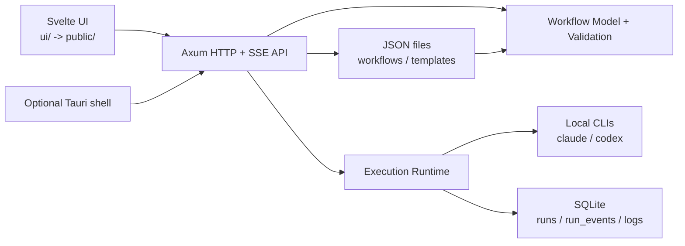

# SilverBond Architecture

## Purpose

This document describes SilverBond as it exists today.

SilverBond is a local graph execution product. The Rust runtime is the system of record.
The Svelte UI is an authoring and inspection surface over that runtime, not a second
source of workflow truth. The optional Tauri shell wraps the same runtime and browser
contract; it does not introduce a separate desktop execution model.

For detailed documentation, see [docs/](docs/README.md).

## Architecture In One Sentence

SilverBond is a local Rust runtime with an embedded Svelte frontend that can run either:

- as a standalone localhost app launched with `cargo run`
- or inside an optional Tauri shell that opens the same localhost app on an ephemeral port

In both cases, workflow definitions stay local JSON files, runtime durability lives in SQLite,
and execution happens by shelling out to local agent CLIs such as `claude` and `codex`.

## Core Principles

### Local-first

SilverBond remains usable as a local tool with no required hosted coordinator,
remote queue, or managed database.

### Runtime-authoritative behavior

Workflow validation, graph analysis, prompt resolution, structured-output parsing,
checkpoint semantics, run control, restart semantics, and event history belong in Rust.

### Graph-native schema

Control flow is explicit in the workflow document:

- `entryNodeId`
- `nodes[]`
- `edges[]`

There is no legacy step chain in the current architecture.

### Durable concurrency before richer convergence

Split and collector behavior already run on top of durable multi-cursor checkpoints and
execution epochs. Future join behavior should continue that pattern rather than reintroducing
implicit traversal rules.

### Observability is part of the product

If the runtime makes a decision, the user should be able to inspect it later through:

- SSE events
- persisted checkpoints
- event journal replay
- execution logs
- interrupted-run summaries

### Packaging does not fork runtime semantics

Tauri is packaging and windowing. It must preserve the same Rust runtime core and
HTTP/SSE browser contract instead of replacing them with a second API model.

## Runtime Topology

## Runtime Hosts

### Standalone host

The standalone app is launched with `cargo run`.

- binds to `127.0.0.1:3333`
- serves the embedded frontend and `/api/*` routes from the same origin
- stores state under the current working directory by default
- accepts `SILVERBOND_ROOT` to override that app root explicitly

### Tauri host

The optional Tauri shell lives in `src-tauri/`.

- starts the same Rust host in-process
- binds the backend to `127.0.0.1:0` and uses the resolved ephemeral port
- waits for `GET /api/health` before opening the main window
- stores workflows, templates, and SQLite state under the platform app-data directory
- seeds bundled templates into that app-data directory on first launch

The Tauri window points at the same localhost runtime URL the browser would use.

## Current System Overview

The production shape is:

- one Rust runtime library plus a standalone CLI entrypoint
- a reusable host layer for explicit paths, bind addresses, and shutdown handling
- static assets embedded from `public/` via `include_dir`
- frontend source authored in `ui/` with Vite, Svelte 5, and TypeScript
- workflow and template storage in local filesystem directories
- runtime durability in SQLite
- browser-to-runtime communication through HTTP and SSE

## Source Layout

### `/src/main.rs`

Standalone CLI entrypoint.

Responsibilities:

- initialize tracing
- resolve the standalone app root
- start the reusable host on `127.0.0.1:3333`
- shut down cleanly on `ctrl_c`

### `/src/app.rs`

Application composition root.

Responsibilities:

- define application paths
- initialize workflow/template stores and SQLite
- optionally seed bundled templates
- construct shared application state
- mount API routes and frontend asset serving

### `/src/host.rs`

Reusable host lifecycle layer.

Responsibilities:

- start the runtime on an explicit socket address
- expose the resolved local URL
- wait for `/api/health`
- support graceful shutdown for standalone and Tauri entrypoints

### `/src/frontend.rs`

Embedded frontend asset serving.

Responsibilities:

- embed `public/`
- serve `index.html` and hashed assets
- support client-side routing fallback

### `/src/api.rs`

HTTP and SSE surface area.

Responsibilities:

- health and capabilities bootstrap
- workflow CRUD
- workflow validation
- template listing
- node preview testing
- run creation and lifecycle control
- SSE streaming and event replay
- interrupted-run and history endpoints

### `/src/runtime.rs`

Execution engine and agent integration layer.

Responsibilities:

- create and persist checkpoints
- execute graph workflows with multi-cursor state where needed
- resolve prompts and context (variable substitution, context sources)
- resolve per-node agent configuration (node → workflow defaults → driver defaults)
- call local agent CLIs via the driver abstraction layer
- parse structured output and validate against JSON Schema
- pre-scan workflows for session persistence requirements
- drive deterministic branch and loop decisions
- manage approvals, aborts, resume, and restart-from
- emit and persist runtime events and execution logs

### `/src/driver.rs`

Agent abstraction layer.

Responsibilities:

- define the `AgentDriver` trait (`name`, `capabilities`, `build_args`, `parse_output`)
- implement `ClaudeDriver`, `CodexDriver`, and `GeminiDriver`
- normalize agent output into `AgentOutput` with token counts, cost, outcome classification
- map access modes to agent-specific CLI permission flags
- provide agent discovery and capability reporting

### `/src/storage.rs`

Persistence layer.

Responsibilities:

- initialize SQLite schema
- persist and reload runs
- append and replay runtime events
- persist execution logs
- list interrupted runs and history
- read and write workflow JSON files
- read template JSON files
- seed bundled templates into a runtime app root when requested

### `/src-tauri/`

Optional Tauri shell.

Responsibilities:

- start the same Rust host with app-data paths
- open a desktop window against the resolved localhost URL
- shut the host down cleanly when the window exits

### `/ui/`

Frontend source tree.

Responsibilities:

- graph-native workflow editing
- backend-driven validation rendering
- run control and SSE presentation
- history and interrupted-run views

Important frontend boundaries:

- `ui/src/lib/api/client.ts` is the frontend contract to Rust
- `ui/src/lib/stores/workflowStore.svelte.ts` holds client-only editor state
- `ui/src/features/editor/GraphEditor.svelte` owns SvelteFlow interop
- `public/` is generated build output, not the source of truth

## Workflow Model

### Canonical format

The only accepted workflow format is version `3`.

Top-level fields:

- `version`
- `name`
- `goal`
- `cwd`
- `useOrchestrator`
- `entryNodeId`
- `variables[]`
- `limits`
- `nodes[]`
- `edges[]`
- `agentDefaults` (per-agent default configuration)
- `ui.canvas`

Nodes support per-node `agentConfig` overrides (model, reasoning level, system prompt, access mode,
tool toggles, budget/turn limits, allowed/disallowed tools), a `cwd` override, and `continueSessionFrom`
for session continuity across nodes. Configuration resolves as: node `agentConfig` → workflow
`agentDefaults[agent]` → driver defaults.

### Node types today

Current first-class node types:

- `task`
- `approval`
- `split`
- `collector`

Explicit `join` nodes are still planned.

### Edge outcomes today

Current first-class edge outcomes:

- `success`
- `reject`
- `branch`
- `loop_continue`
- `loop_exit`

### Persisted UI metadata

The workflow document may include:

- `ui.canvas.viewport`
- `ui.canvas.nodes`

This metadata is for layout only. It must not change runtime semantics.

## Execution Model

### Run lifecycle

The current run lifecycle is:

1. the client submits a workflow to `POST /api/runs`
2. the backend validates the workflow
3. the runtime creates and persists an initial checkpoint
4. execution starts on the Tokio runtime
5. events are appended to SQLite and published to in-memory subscribers
6. the client subscribes through `GET /api/runs/{id}/stream`
7. terminal state and execution log are persisted

### Checkpoint model today

The current checkpoint model is multi-cursor and execution-epoch aware.

Key state includes:

- `executionEpoch`
- `activeCursors[]`
- cursor-local output and provenance
- `splitFamilies`
- `collectorBarriers`
- per-node results
- loop counters
- visit counters
- workflow variables
- pending approval state
- execution log snapshot

This is sufficient for approvals, split fan-out, collector convergence, resume, and restart-from.
Explicit join nodes still need their own schema and aggregate-input semantics.

### Event vocabulary

Important runtime events today include:

- `run_start`
- `run_resumed`
- `node_start`
- `node_done`
- `node_retry`
- `node_skipped`
- `branch_decision`
- `loop_decision`
- `cursor_spawned`
- `collector_waiting`
- `aggregate_merged`
- `collector_released`
- `approval_queued`
- `approval_required`
- `cursor_cancelled`
- `transition`
- `workflow_error`
- `done`

### Restart semantics

`restart-from` creates a new run ID and increments the execution epoch so stale split/collector
state cannot satisfy the restarted path accidentally.

## Persistence Model

### Filesystem-backed definitions

Workflow and template definitions remain local JSON files.

Standalone mode defaults to:

- `workflows/`
- `templates/`

Tauri mode uses the same layout under the platform app-data root.

### SQLite-backed runtime state

Runtime state lives in `.silverbond/silverbond.sqlite` under the active app root.

Current tables:

- `runs`
- `run_events`
- `logs`

This split is deliberate:

- `runs` stores recoverable checkpoint state
- `run_events` stores ordered event history for replay and SSE catch-up
- `logs` stores durable execution summaries for history views

## HTTP API Surface

Important routes today:

- `GET /api/health`
- `GET /api/capabilities`
- `GET /api/workflows`
- `GET /api/workflows/{name}`
- `POST /api/workflows`
- `DELETE /api/workflows/{name}`
- `POST /api/validate-workflow`
- `GET /api/templates`
- `POST /api/test-node`
- `POST /api/runs`
- `GET /api/runs/{runId}/stream`
- `GET /api/runs/{runId}/events`
- `POST /api/runs/{runId}/approve`
- `POST /api/runs/{runId}/abort`
- `POST /api/runs/{runId}/resume`
- `POST /api/runs/{runId}/restart-from/{nodeId}`
- `POST /api/runs/{runId}/dismiss`
- `GET /api/interrupted-runs`
- `GET /api/logs`
- `GET /api/logs/{id}`
- `DELETE /api/logs/{id}`

Two interface decisions matter most:

- run creation is separate from run streaming
- Tauri preserves this HTTP/SSE surface instead of replacing it

## Agent Integration Model

Current provider adapters:

- `claude` (most capable — supports all 15 capability flags)
- `codex`
- `gemini`

Each adapter implements the `AgentDriver` trait (`driver.rs`) which declares capabilities, builds
CLI arguments, and parses agent output into a normalized `AgentOutput` struct with token counts,
cost, session ID, structured output, and outcome classification.

The runtime resolves executables directly from PATH, preferring the inherited environment and,
on macOS, common GUI-install locations such as `/opt/homebrew/bin` and `/usr/local/bin`.

The runtime asks providers about capabilities such as:

- worker execution
- prompt refinement, branch choice, loop verdict (orchestrator features)
- structured output and native JSON Schema support
- session reuse
- model selection, reasoning level, system prompt
- budget and turn limits, cost reporting
- tool allowlist/denylist, web search toggle

This keeps runtime logic stable while provider differences stay localized.
The frontend uses capability flags to show/hide configuration options per agent.

## What The Current Architecture Does Not Do

The system intentionally does not yet provide:

- legacy workflow migration or legacy log import
- explicit `join` node execution
- remote orchestration services
- cloud-hosted state
- a Tauri-specific runtime or command/event API separate from the browser contract

## Direction Of Development

The next architectural steps should happen in this order:

1. harden the current Svelte editor and backend contract
2. improve browser and CLI end-to-end coverage
3. add explicit `join` nodes with deterministic aggregate inputs
4. expand graph debugging and history tooling around cursor state
5. continue treating Tauri as packaging over the same runtime, not a fork

## Design Rule For Future Changes

When evaluating a new feature, ask:

1. Is this runtime truth or just presentation?
2. If it changes traversal semantics, is it represented in the schema?
3. Can it survive process restart and be explained from persisted state?
4. Can the user inspect what happened afterward?
5. Does it move SilverBond toward a graph-native runtime rather than back toward frontend-owned behavior?
